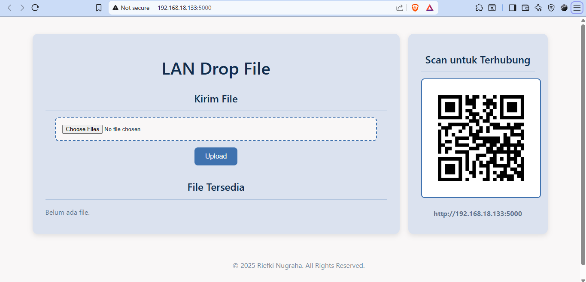

# LAN File Drop - Real-time Local File Sharing

Sebuah aplikasi web sederhana, cepat, dan real-time untuk berbagi file antar perangkat dalam satu jaringan Wi-Fi lokal. Dibangun dengan Python Flask, aplikasi ini memungkinkan transfer file secara langsung tanpa memerlukan koneksi internet atau instalasi aplikasi di sisi klien.

<div align="center">



</div>

---

## ✨ Fitur Utama

- **Transfer Real-time**: Daftar file diperbarui secara otomatis untuk semua pengguna saat ada file yang diunggah atau dihapus, tanpa perlu me-refresh halaman.
- **Upload Multi-File**: Mengizinkan pengguna memilih dan mengunggah beberapa file sekaligus.
- **Akses Cepat via QR Code**: Pengguna mobile dapat terhubung dengan mudah hanya dengan memindai QR code yang tampil di halaman web.
- **Hapus File**: Fitur untuk menghapus file yang sudah diunggah langsung dari antarmuka web.
- **Desain Responsif**: Tampilan yang menyesuaikan dengan baik di perangkat desktop maupun mobile.
- **Setup Sederhana**: Hanya perlu dijalankan di satu komputer sebagai server.

## 🛠️ Tech Stack

- **Backend**: Python, Flask
- **Frontend**: HTML5, CSS3, JavaScript (untuk Server-Sent Events)
- **Library Python**: `qrcode[pil]`

## 🚀 Instalasi & Persiapan

Ikuti langkah-langkah ini untuk menjalankan proyek secara lokal.

1.  **Clone Proyek**
    Buka terminal atau Git Bash dan clone repositori ini.
    ```bash
    git clone https://github.com/riefki-123/LAN-Drop-File
    ```

2.  **Masuk ke Direktori Proyek**
    ```bash
    cd Portal-File-Sharing
    ```

3.  **Buat Virtual Environment**
    Sangat disarankan untuk menggunakan environment virtual agar dependensi proyek terisolasi.
    ```bash
    python -m venv env
    ```

4.  **Aktifkan Virtual Environment**
    -   **Windows:**
        ```bash
        .\env\Scripts\activate
        ```
    -   **macOS / Linux:**
        ```bash
        source env/bin/activate
        ```

5.  **Buat & Install Dependensi**
    Aplikasi ini membutuhkan beberapa library Python. Buat file `requirements.txt` terlebih dahulu.
    install semua library yang dibutuhkan.
    ```bash
    pip install -r requirements.txt
    ```

6.  **Jalankan Aplikasi**
    Setelah semua dependensi terpasang, jalankan server Flask.
    ```bash
    python app.py
    ```
    Server akan berjalan, dan Anda akan melihat alamat IP serta QR code untuk mengakses aplikasi.

## ⚙️ Cara Penggunaan

1.  Setelah server berjalan, buka browser di komputer yang sama dan akses `http://127.0.0.1:5000`.
2.  Untuk perangkat lain (ponsel atau laptop) yang terhubung ke **jaringan Wi-Fi yang sama**:
    -   **Scan QR code** yang ada di halaman web, atau
    -   Ketik manual alamat IP lokal yang ditampilkan di terminal (contoh: `http://192.168.1.10:5000`).
3.  Sekarang Anda bisa mulai mengunggah, mengunduh, dan menghapus file secara real-time.

## 🤝 Kontribusi

Kami sangat terbuka untuk *Pull Request*. Jika Anda ingin melakukan perubahan besar, silakan buka *issue* terlebih dahulu untuk mendiskusikan apa yang ingin Anda ubah.

---

<div align="center">
  Dibuat dengan ❤️ oleh Riefki Nugraha
</div>